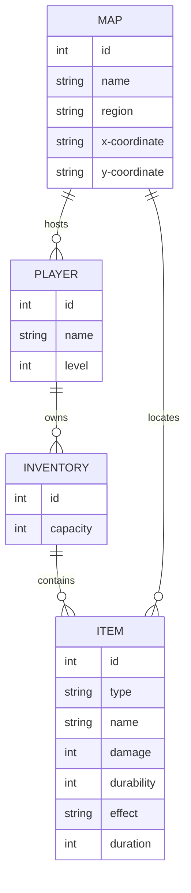

# Diagrama de relaciones - RPG Inventory System

```mermaid
---
title:RPG Inventory System 
---
erDiagram
    PLAYER ||--o{ INVENTORY : owns
    INVENTORY ||--o{ ITEM : contains
    MAP ||--o{ ITEM : locates
    MAP ||--o{ PLAYER : hosts

    PLAYER {
        int id
        string name
        int level
    }

    INVENTORY {
        int id
        int capacity
    }

    ITEM {
        int id
        string type
        string name
        int damage
        int durability
        string effect
        int duration
    }

    MAP {
        int id
        string name
        string region
        string x-coordinate
        string y-coordinate
    }
    
```

